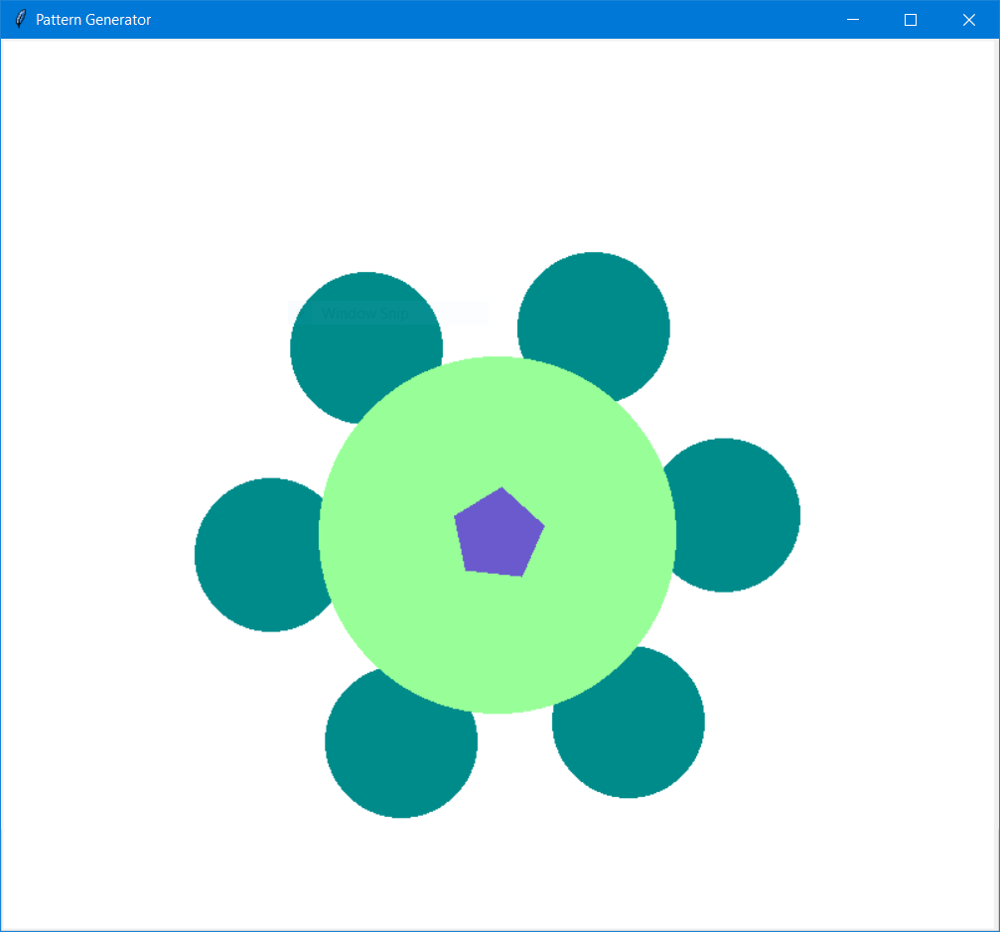

# Pattern Generator

## Table of Contents
- [Overview](#overview)
- [Features](#features)
- [Installation](#installation)
- [Prerequisites](#prerequisites)
- [Installation](#installation)
- [Usage](#usage)
- [Examples](#examples)
- [Contribution](#contribution)
- [License](#license)

---

## Overview
The **Pattern Generator** is an interactive Python application that creates intricate and visually appealing patterns. Users can generate, view, and save unique geometric designs, combining randomness and predefined templates for variety and creativity.

This project is powered by **Tkinter** for the GUI interface and **Pillow** for advanced image creation and manipulation.

---

## Features
- **Template-Based Design**:
  - Includes several predefined templates, such as:
    - Lotus Flower
    - Symmetrical Star
    - Floral Mandala
    - Geometric Shapes
    - Peacock Feather
- **Customizable Patterns**:
  - Shapes, colors, rotations, and size variations are randomized to create a unique pattern every time.
- **Interactive GUI**:
  - View generated patterns on a resizable canvas.
  - Save patterns as PNG files.
- **Console Integration**:
  - Includes console-based options to regenerate patterns or save the current design.

---

## Installation

### Prerequisites
- Python 3.8 or higher
- A properly configured Python environment with the required libraries.

### Installation Steps
1. Clone the repository:
   ```bash
   git clone https://github.com/suryanarayanrenjith/pattern-generator.git
   cd pattern-generator
   ```
2. Install the dependencies:
   ```bash
   pip install -r requirements.txt
   ```
3. Ensure you have a `colors.txt` file with your desired color configurations in the following format:
   ```
   red:255,0,0
   green:0,255,0
   blue:0,0,255
   ```
   *(You can add more colors with names and RGB values.)*

---

## Usage

1. **Run the Application**:
   ```bash
   python pattern.py
   ```
2. **Interactive Options**:
   - Use the GUI to view the generated pattern.
   - Save the pattern using the "Download Image" option.
   - Regenerate a new pattern through the console by choosing option 2.
   - Exit the application via the console by choosing option 3.

---

## Examples
### Pattern Output


---

## Contribution
Contributions are welcome! If you'd like to add new templates, features, or improvements, feel free to fork the repository and submit a pull request.

---

## License
This project is licensed under the [MIT License](LICENSE).

---
